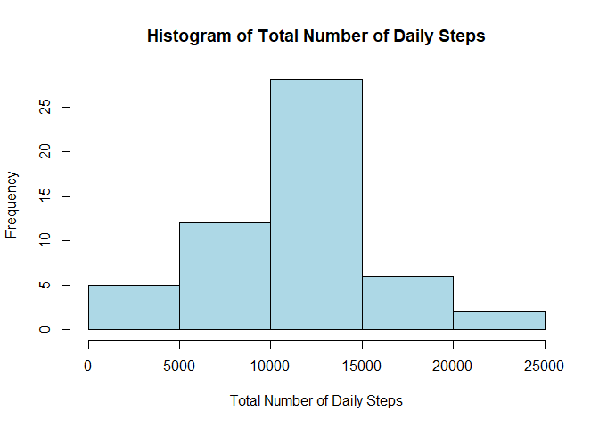
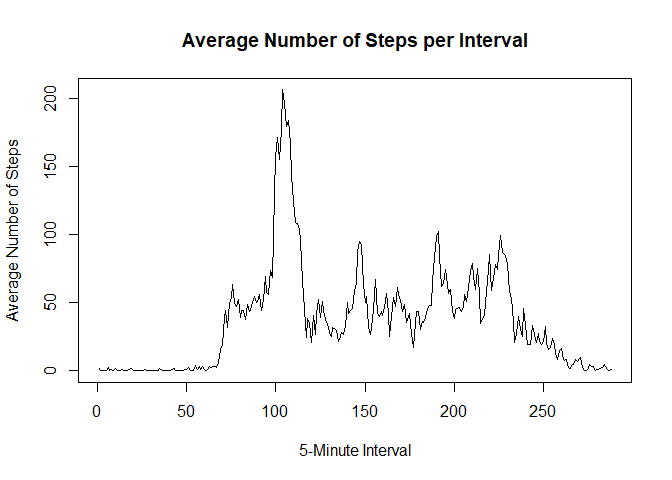
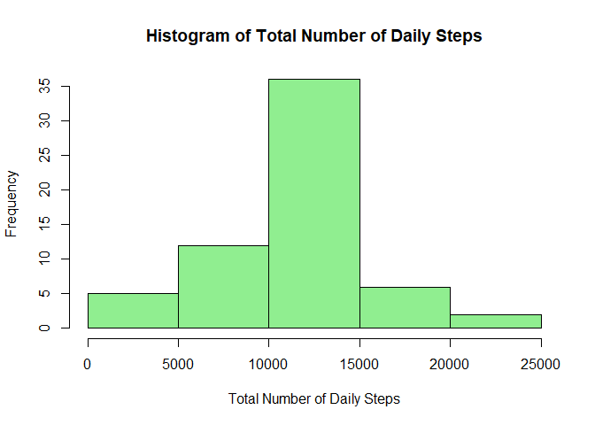
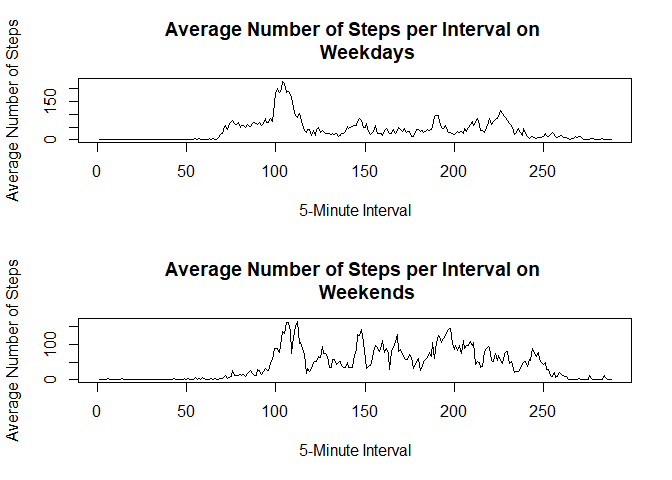

## Loading and preprocessing the data

First, I am going to load the data and turn the date variable into the date class.


```r
unzip("activity.zip")
data <- read.csv("activity.csv")
data$date <- as.Date(data$date)
```

## What is mean total number of steps taken per day?

Next, I am going to calculate the total number of steps taken per day and 
display them in a histogram. I am also going to calculate and report the mean 
and median of the total number of daily steps.


```r
totaldaily <- with(data, tapply(steps, date, sum))
hist(totaldaily, main="Histogram of Total Number of Daily Steps", 
     xlab="Total Number of Daily Steps", col="lightblue")
```

<!-- -->

```r
mean(totaldaily, na.rm=TRUE)
```

```
## [1] 10766.19
```

```r
median(totaldaily, na.rm=TRUE)
```

```
## [1] 10765
```

As we can see, the mean of the total number of steps taken per day is about 10766 whereas the median is 10765.

## What is the average daily activity pattern?

Here I am going to make a time series plot of the 5-minute interval (x-axis) 
and the average number of steps taken, averaged across all days (y-axis).


```r
meaninterval <- with(data, tapply(steps, interval, mean, na.rm=TRUE))
plot(meaninterval, type="l", main="Average Number of Steps per Interval", 
     xlab="5-Minute Interval", ylab="Average Number of Steps")
```

<!-- -->

```r
which(meaninterval == max(meaninterval))
```

```
## 835 
## 104
```

```r
meaninterval[104]
```

```
##      835 
## 206.1698
```

We can see that, on average across all the days in the dataset, interval 835 has the most number of steps with roughly 206.

## Imputing missing values

Since there are a number of missing values, I am now going to calculate the total number of missing values in the dataset.


```r
sum(is.na(data$steps))
```

```
## [1] 2304
```

The total number of rows with NAs is 2304.

I am now going to create a new dataset that is equal to the original dataset but fill in all of the missing values using the mean number of steps for that 5-minute interval.
Then, with this new dataset, I am going to make a histogram of the total number of steps taken each day and calculate the mean and median total number of daily steps.


```r
newdata <- data
while (sum(is.na(newdata$steps)) > 0) {
    newdata$steps[is.na(newdata$steps)] <- 
        meaninterval[as.numeric(names(meaninterval)) == 
                         newdata$interval[is.na(newdata$steps)]]
}
newtotaldaily <- with(newdata, tapply(steps, date, sum))
hist(newtotaldaily, main="Histogram of Total Number of Daily Steps", 
     xlab="Total Number of Daily Steps", col="lightgreen")
```

<!-- -->

```r
mean(newtotaldaily)
```

```
## [1] 10766.19
```

```r
median(newtotaldaily)
```

```
## [1] 10766.19
```

We can see that the mean and the median of the total number of daily steps in this new data set with all the missing values filled in are now identical. The mean did not change compared to the old dataset whereas the median increased slightly.  
The impact of imputing missing data on the estimates of the total daily number of steps is rather small even though the number of missing values was not negligible. One visible difference is in the center bar of the histogram, which is taller with the new data.

## Are there differences in activity patterns between weekdays and weekends?

Next I am going to create a new factor variable in the dataset with the two levels "weekday" and "weekend" indicating whether a given date is a weekday or a weekend day.


```r
newdata$day[weekdays(newdata$date) == "Samstag" | weekdays(newdata$date) == 
                "Sonntag"] <- "weekend"
newdata$day[!(weekdays(newdata$date) == "Samstag" | weekdays(newdata$date) == 
                "Sonntag")] <- "weekday"
newdata$day <- as.factor(newdata$day)
```

Finally, I am going to make a panel plot containing a time series plot of the 5-minute interval and the average number of steps taken, averaged across all weekday days or weekend days.


```r
weekdaymeanint <- with(newdata[newdata$day=="weekday",], tapply(steps, interval, mean))
weekendmeanint <- with(newdata[newdata$day=="weekend",], tapply(steps, interval, mean))

par(mfrow=c(2,1))
plot(weekdaymeanint, type="l", main="Average Number of Steps per Interval on 
     Weekdays", xlab="5-Minute Interval", ylab="Average Number of Steps")
plot(weekendmeanint, type="l", main="Average Number of Steps per Interval on 
     Weekends", xlab="5-Minute Interval", ylab="Average Number of Steps")
```

<!-- -->

Here we can see that during the week the highest activity was recorded around interval 100. On the weekend activity is more spread out throughout the entire day. Furthermore, on the weekend higher activity was recorded in later intervals (around interval 250) which points to the fact that this individual went to bed earlier during the week than they did on the weekend.
